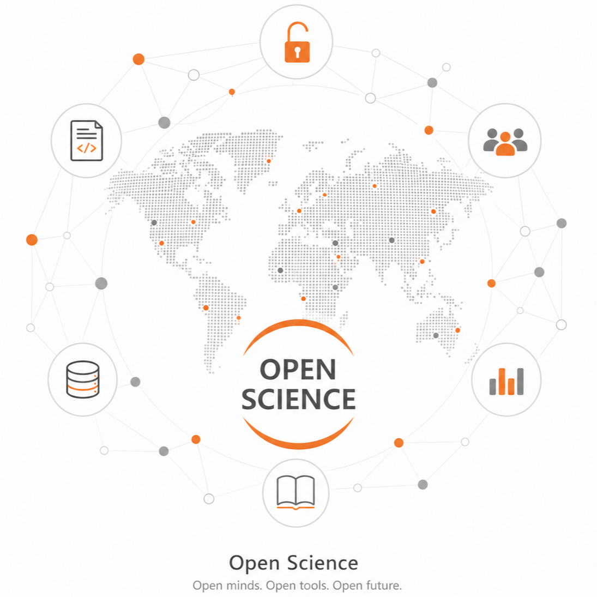
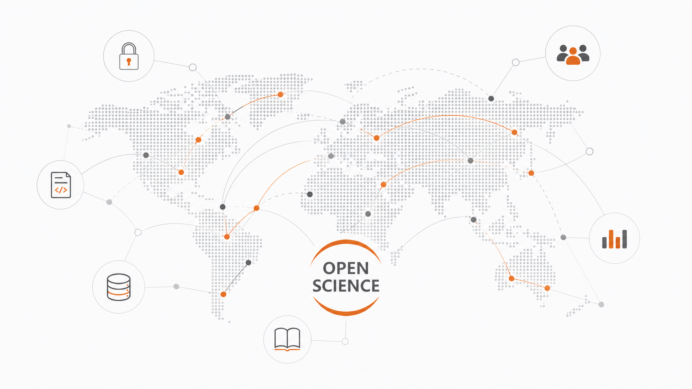

+++ { "kind": "split-image" }

## Welcome to Open Science

An open-source knowledge database, interactive, neural network formation, with AI
<!--  -->

{button}`Get Started </intro>`

+++

+++ {"kind": "centered", "class": "col-body"}

Open knowledge for the AI era

## About Open Science

Open Science is a community-built knowledge platform for learning, teaching, and exploring science without borders. We turn expert-edited STEM content into connected, multilingual, and interactive learning paths that anyone can use, extend, and improve.

Start with one topic, such as MOFs, and follow the links outward: organic chemistry, characterization, machine learning, visualization, notebooks, datasets, and frontier research updates. Built with open-source tools from the Jupyter ecosystem, this project is designed to be readable by humans, executable by learners, and useful alongside modern AI systems.

:::{important} What we stand for

- Free access: no paywalls, no fees, no artificial barriers.
- Global participation: no geographic gatekeeping, no geopolitical ownership of knowledge.
- Community standards: open-source workflows, transparent review, and expert stewardship.
- Multilingual learning: science should be understandable across languages and backgrounds.
- AI-assisted, human-checked content: faster updates without giving up accuracy.

Contribute for science. Build with the world.
:::

+++

## Our projects
:::::{grid} 1 2 2 2
::::{card}
:url: https://openscienceteam.github.io/General-Chemistry/
:footer: General Chemistry

:::{image} ./images/books/General-Chemistry.png
:height: 100px
:::
::::

::::{card}
:url: https://openscienceteam.github.io/aiforscience/
:footer: Generative Models for Materials Science

:::{image} ./images/books/aiforscience.png
:height: 100px
:::
::::

:::::

+++ {"kind": "logo-cloud", "class": "org-logo-cloud"}

Our Supporters and Initiative Collaborators

::::{grid} 1 2 3 5

:::{figure} ./images/org/sustech.png
:::
:::{figure} ./images/org/Berkeley.png
:::

:::{figure} ./images/org/Berkeley2.png
:::

:::{figure} ./images/org/bids.png
:::

:::{figure} ./images/org/jupyter.png
:::
::::

